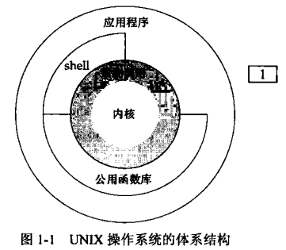

# 1. UNIX基础知识
## 1.1 引言
所有操纵系统都为它们所运行的程序提供服务。典型的服务包括：执行新程序、打开文件、读文件、分配存储区以及获得当前时间等，本书集中阐述不同版本的UNIX操作系统提供的服务。

想要按严格的先后顺序介绍UNIX,而不超前引用尚未介绍过的术语，这几乎是不可能的（可能也会令人厌烦）。本章从程序员的角色快速浏览UNIX，对书中引用的一些术语和概念进行简要的说明并给出实例。在以后各章中，将对这些概念做更详细的说明。对于初涉UNIX环境的程序员，本章还简要介绍 UNIX提供的各种服务。

## 1.2 UNIX体系结构
从严格意义上说，可将操作系统定义为一种软件，它控制计算机硬件资源，提供程序运行环境。我们通常讲这种软件成为内核(kernel),因为它相对较小，而且位于环境的核心。图1-1显示了Unix系统的体系结构。


内核的接口被成为系统调用(system call, 图1-1中的阴影部分)。公用函数库构建在系统调用接口上，应用程序即可使用公用函数库，也可使用系统调用。shell上一个特殊的应用程序，为运行其他应用程序提供了一个接口。

从广义上说，操作系统包括了内核和一些其他软件，这些软件使得计算机能够发挥作用，并使计算机具有自己的特征。这里所说的其他软件包括系统实用程序(system utility)、应用程序、shell以及公用函数库等。

例如，Linux是GNU操作系统使用的内核。一些人讲这种操作系统称为GNU/Linux操作系统，但是，更常见的是简单地称为Linux。虽然这种表达方法在严格意义上讲并不正确。但鉴于“操作系统”这个词的双重含义，这种叫法还是可以理解的（这样的叫法更简介）。

## 1.3 登录
1. 登录名

用户在登录UNIX系统时，先键入登录名，然后键入口令。系统在其口令文件（通常是/etc/passwd文件）中查看登录名。口令文件的登录项由7个以冒号分隔的字段组成，依次是：登录名、加密口令、数字用户ID(205)、数字组（105），注释字段、起始目录(/home/sar)以及shell程序（/bin/ksh）。

```bash
sar:x:205:105:Stephen Rage:/home/sar:/bin/ksh
```
目前，所有的系统已将加密口令移到另一个文件中。第6章将说明这种文件以及访问它们的函数。

2. shell

用户登录后，系统通常先显示一些系统信息，然后用户就可以向shell程序键入命令。（当用户登录时，某些系统启动一个视窗管理程序，但最终总会有一个shell程序运行在一个视窗中）。shell是一个命令行解释器，它读取用户输入，然后执行命令。shell的用户输入通常来自于终端（交互式shell），有时则来自于文件（称为shell脚本）。图1-2总结了unix系统中常见的hell。


系统从口令文件中相应用户登录项的最后一个字段中了解到应该为该登录用户执行哪一个shell。

自V7以来，有Steve Bourne在贝尔实验室开发的Bourne shell得到了广泛应用，几乎每一个现有的Unix系统都提供Bourne shell,其控制流结构类似于Algol68。

C shell是由Bill Joy在伯克利开发的，所有BSD版本都提供这种shell。另外，AT&T的System V/386 R3.2和System V R4(SVR4)也提供C shell(下一章将对这些不同版本的Unix系统做更多的说明)。C shell是在第6版而非Bourrne shell的基础上构造的，其控制流类似于C语音，它支持Bourne shell没有的一些特色功能，例如作业控制，历史机制以及命令行编辑等。

Korn shell是Bourne shell的后继者，它首先在SVR4中提供。Korn shell是有贝尔实验室的David Korn开发的，在大多数Unix系统上运行，但在Svr4之前，通常它需要另行购买，所有没有其他两种shell流行。它于Bourne shell向上兼容，病具有使C shell广泛得到应用的一些特色功能，包括作业控制以及命令行编辑等。

Bourne-again shell 是GNU shell,所有Linux系统都提供这种shell。它的设计遵循POSIX标准，同时也保留了与Bourne shell的兼容性。它支持C shell和Korn shell两者的特色功能。

TENEX C shell是C shell的加强版本。它从TENEX操作系统（1972年BBN公司开发）借鉴了很多特色，例如命令完备。TENEX C shell在C shell基础上增加了很多特性，常被用来替换C shell.

POSIX 1003.2标准对Shell进行了标准化。这项规范基于Korn shell和Bourne shell的特性。

本书将使用很多交互式Shell实例来执行所开发的程序，这些实例使用了Bourne shell, Korn shell和Bourne-again shell通用的功能。

## 1.4 文件和目录

1. 文件系统

UNIX文件系统是目录和文件的一种层次结构，所有东西的起点是称为根(root)的目录，这个目录的名称是一个字符"/"。
目录（directory）是一个包含目录项的文件。在逻辑上，可以认为每个目录项都包含一个文件名，同时还包含说明该文件属性的信息。文件属性是指文件类型（是普通文件还是目录等）、文件大小、文件所有者、文件权限（其他用户能否访问该文件）以及文件最后修改的时间等。stat和fstat函数返回包含所有文件属性的一个信息结构。第4章将详细说明文件的各种属性。

目录项的逻辑视图与实践存放在磁盘上的方式是不同的。UNIX文件系统的大多数实现并不在目录项中存放属性，这是因为当一个文件具有多个硬链接时，很难保持多个属性副本之间的同步。这一点在第4章讨论硬链接是理解得更明晰。

2. 文件名

目录中的各个名字称为文件名（filename)。只有斜线(/)和空字符这两个字符不能出现在文件名中。斜线用来分隔构成路径的各文件名，空字符则用来终止一个路径名。尽管如此，好的习惯还是只使用常用印刷字符的一个子集作为文件名字符（如果在文件名中使用了某些shell的特殊字符，则必须使用shell的引号机制来引用文件名，这会带来很多麻烦）。事实上，为了可移植性，POSIX.1推荐将文件名限制在以下字符集之内：字母(a-z、A-Z)、数字（0-9）、句点（.）、短横线（-）和下划线（_）。
创建新目录时会自动创建了两个文件名：. (称为点)和..(称为点点)。点指向当前目录，点点指向父目录。在最高层次的根目录中，点点与点相同。
3. 路径名

由斜线分隔的一个或多个文件名组成的序列（也可以斜线开头）构成路径名（pathname），以斜线开头的路径名为绝对路径名（absolute pathname），否则称为相对路径名（relative pathname）。相对路径名指向相对于当前目录的文件。文件系统根的名字(/)是一个特殊的绝对路径名，它不包含文件名。

+ 实例

不难列出一个目录中所有文件的名字，图1-3是ls(1)命令的简要实现。

```c
#include <stdio.h>
#include <stdlib.h>
#include <dirent.h>
int main(int argc, char * argv[]) {
        DIR *dp;
        struct dirent * dirp;
        if(argc != 2){
                printf("usage: ls directory_name");
                exit(1);
        }
        if((dp=opendir(argv[1])) == NULL) {
                printf("can't open %s", argv[1]);
                exit(1);
        }
        while((dirp = readdir(dp)) != NULL) {
                printf("%s\n",dirp->d_name);
        }
        closedir(dp);
        exit(0);
}

```
图1-3 列出一个目录中所有文件
ls(1)这种表示方法是unix系统的惯用方法，用以引用Unix系统手册中的一个特定项。ls(1)引用第一部分中的ls项。各部分通常用数字1-8编号，在每个部分中的各项则按字母顺序排列。在本书中始终假定你有自己所使用的UNIX系统的手册。

现今，大多数手册都以电子文档形式提供。如果用的是联机手册，则可用下面的命令查看ls命令手册页：
```bash
man l ls 
```
或
```bash
man -sl ls
```
图1-3只打印一个目录中各个文件的名字，不显示其他信息，如果该源文件名为myls.c,则可以用下面的命令对其进行编译，编译结果是生成默认名为a.out的可执行文件中。
```bash
cc myls.c
```


